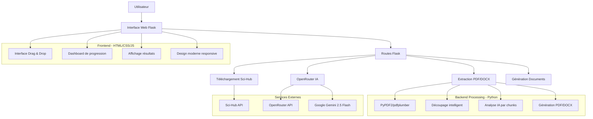
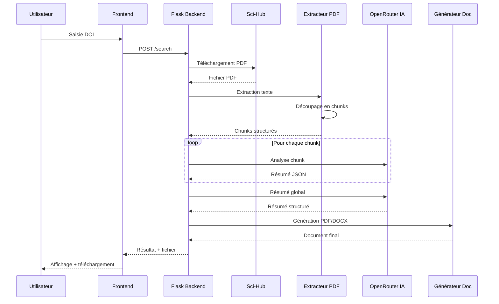
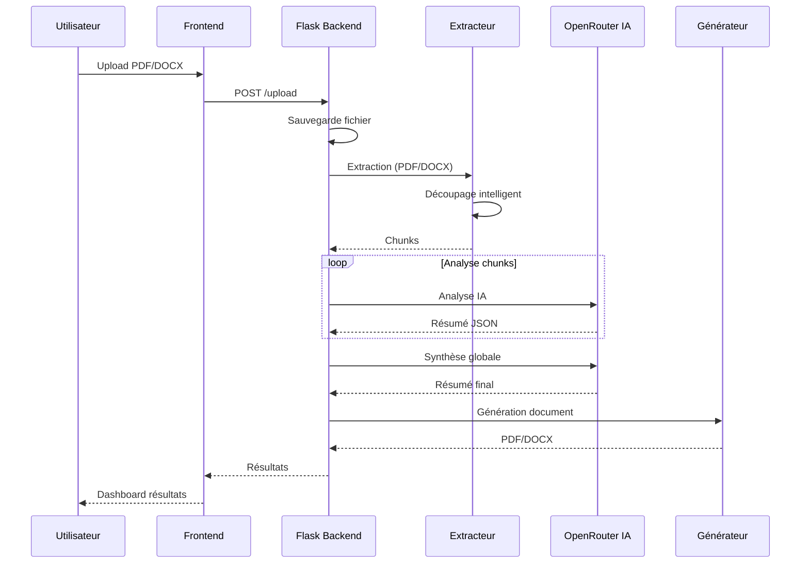
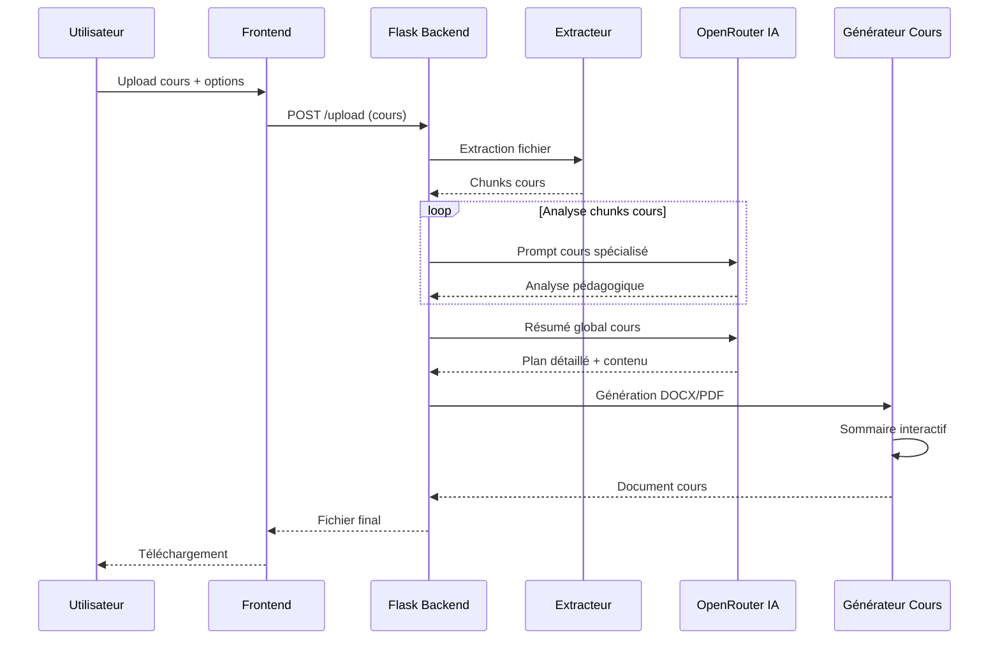

# DOI RESUME - Analyseur Intelligent de Documents Académiques

> **Système intelligent d'analyse et de résumé de documents académiques via DOI avec IA**

[](https://python.org)
[](https://flask.palletsprojects.com)
[](https://openrouter.ai)
[](https://ai.google.dev)
[](https://pypdf2.readthedocs.io)
[](LICENSE)

---

## Vue d'ensemble

**DOI Resume** est une plateforme web intelligente qui automatise l'analyse et le résumé de documents académiques. Le système télécharge automatiquement les PDFs depuis Sci-Hub via leur DOI, extrait le contenu, et génère des résumés structurés adaptés à différents besoins (académique, exécutif, technique, cours).

---

## Fonctionnalités principales

- **Recherche par DOI** : Téléchargement automatique de PDFs depuis Sci-Hub via DOI
- **Upload de fichiers** : Support PDF et DOCX pour analyse locale
- **Mode Cours** : Génération de résumés stratégiques avec sommaire interactif
- **Analyse IA avancée** : Extraction intelligente avec Google Gemini 2.5 Flash Lite
- **Résumés multi-types** : Académique, exécutif, technique, étudiant, recherche, personnalisé
- **Génération de documents** : Export en PDF et DOCX formatés
- **Résumés de cours** : Création de documents pédagogiques avec plan détaillé
- **Analyse personnalisée** : Intégration intelligente avec votre travail de recherche

---

## Architecture du système



---

## Technologies utilisées

### Frontend
- **HTML5/CSS3** : Interface moderne et responsive
- **JavaScript ES6+** : Gestion des interactions et polling
- **Font Awesome** : Icônes professionnelles
- **Drag & Drop API** : Upload intuitif de fichiers

### Backend
- **Python 3.13+** : Langage principal pour le traitement
- **Flask 3.0** : Framework web léger et flexible
- **OpenRouter API** : Accès aux modèles IA (Google Gemini 2.5 Flash Lite)
- **PyPDF2 + pdfplumber** : Extraction de texte depuis PDF avec structure
- **python-docx** : Génération de documents Word
- **reportlab** : Génération de PDFs formatés
- **LangChain** : Découpage intelligent de texte

### Services externes
- **Sci-Hub** : Téléchargement automatique de PDFs académiques
- **OpenRouter** : API unifiée pour l'accès aux modèles IA
- **Google Gemini 2.5 Flash Lite** : Modèle IA rapide et économique

---

## Intelligence Artificielle

### Modèle utilisé
**Google Gemini 2.5 Flash Lite** via OpenRouter API
- Rapide et économique
- Excellente compréhension du contexte académique
- Structuration précise des données JSON
- Parsing robuste avec nettoyage automatique

### Types d'analyse

#### 1. Analyse par chunks
- Découpage intelligent respectant la structure du document
- Analyse individuelle de chaque chunk
- Extraction de concepts clés, résumés, importance

#### 2. Résumé global
- Synthèse de tous les chunks analysés
- Génération de résumés structurés selon le type choisi
- Identification automatique du domaine et de la qualité

#### 3. Mode Cours
- Analyse pédagogique spécialisée
- Création de plans détaillés avec chapitres et sections
- Génération de documents avec sommaire interactif

---

## Performance

### Temps de traitement
- **Téléchargement PDF** : 5-10 secondes (Sci-Hub)
- **Extraction texte** : 2-5 secondes (selon taille)
- **Découpage en chunks** : 1-2 secondes
- **Analyse IA (par chunk)** : 3-5 secondes
- **Résumé global** : 5-10 secondes
- **Génération document** : 2-3 secondes

### Optimisations
- **Découpage intelligent** : Respect de la structure du document
- **Traitement asynchrone** : Threads en arrière-plan
- **Parsing JSON robuste** : Nettoyage automatique des réponses IA
- **Gestion d'erreurs** : Retry et fallback automatiques

---

## Flux de données

### 1. Recherche par DOI



### 2. Upload et analyse de fichier



### 3. Mode Cours



---

## Structure du projet

```
doi_resume/
├── app.py                          # Application Flask principale (1278 lignes)
├── openrouter_client_with_logs.py  # Client OpenRouter avec logs détaillés
├── openrouter_config.py            # Configuration OpenRouter
├── pdf_summarizer.py               # Extraction et découpage PDF/DOCX
├── prompt_templates.py             # Templates de prompts IA (534 lignes)
├── course_document_generator.py    # Générateur de documents de cours
├── download_pdf.py                 # Téléchargement depuis Sci-Hub
├── config.py                       # Configuration Sci-Hub
│
├── templates/                      # Templates HTML
│   ├── index.html                 # Interface principale
│   └── results.html               # Page de résultats
│
├── static/                        # Fichiers statiques
│   ├── css/
│   │   └── style.css              # Styles modernes
│   └── js/
│       └── app.js                 # Logique frontend
│
├── uploads/                       # Fichiers uploadés
├── response/                      # Documents générés
├── venv/                          # Environnement virtuel Python
├── requirements.txt               # Dépendances Python
└── README.md                      # Documentation
```

---

## Compétences techniques

### **Développement Backend**
- **Python 3.13+** : Langage principal avec bonnes pratiques
- **Flask 3.0** : Framework web avec architecture REST
- **APIs REST** : Conception et implémentation d'endpoints
- **Gestion des fichiers** : Upload, validation, traitement PDF/DOCX
- **Threading** : Traitement asynchrone en arrière-plan
- **Gestion d'état** : Statut de traitement global

### **Intelligence Artificielle & NLP**
- **OpenRouter API** : Intégration avec modèles IA
- **Prompt Engineering** : Conception de prompts optimisés pour différents contextes
- **Traitement du langage naturel** : Extraction et analyse de texte académique
- **Parsing JSON robuste** : Nettoyage et extraction automatique
- **Découpage intelligent** : Respect de la structure documentaire

### **Traitement de documents**
- **PyPDF2 + pdfplumber** : Extraction de texte avec métadonnées
- **python-docx** : Génération de documents Word structurés
- **reportlab** : Génération de PDFs formatés
- **LangChain** : Découpage intelligent de texte
- **OCR fallback** : Support des PDFs scannés

### **Architecture & DevOps**
- **Architecture modulaire** : Séparation des responsabilités
- **Configuration centralisée** : Gestion des paramètres
- **Logs détaillés** : Traçabilité complète des opérations
- **Gestion d'erreurs** : Handling robuste des exceptions
- **Environnement virtuel** : Isolation des dépendances

### **Développement Frontend**
- **HTML5/CSS3** : Interface responsive et moderne
- **JavaScript ES6+** : Interactivité et gestion des événements
- **Drag & Drop** : Interface utilisateur intuitive
- **AJAX/Polling** : Communication asynchrone avec le backend
- **UX/UI** : Design professionnel et expérience utilisateur

---

## Types de résumés disponibles

### Résumé académique
- Analyse détaillée pour chercheurs et étudiants
- Focus sur méthodologie et résultats
- Structure académique complète

### Résumé exécutif
- Synthèse concise et actionnable
- Pour décideurs et managers
- Points clés et recommandations

### Résumé technique
- Approche spécialisée approfondie
- Détails techniques et implémentations
- Pour ingénieurs et développeurs

### Résumé étudiant
- Simplification pédagogique
- Explications accessibles
- Pour apprentissage

### Résumé recherche
- Focus méthodologie et implications
- Pour chercheurs expérimentés
- Analyse critique

### Résumé personnalisé
- Intégration avec votre travail
- Analyse automatique des relations
- Enrichissement intelligent

### Mode Cours
- Résumés stratégiques pour cours
- Plan détaillé avec chapitres
- Sommaire interactif
- Concepts fondamentaux et exemples

---

## Configuration technique

### **Paramètres IA**

```python
OPENROUTER_CONFIG = {
    "api_key": "sk-or-v1-...",
    "base_url": "https://openrouter.ai/api/v1",
    "default_model": "google/gemini-2.5-flash-lite",
    "generation_params": {
        "max_tokens": 3000,
        "temperature": 0.1,
        "top_p": 0.1
    }
}
```

### **Configuration Sci-Hub**

```python
SCI_HUB_CONFIG = {
    "base_url": "https://www.sci-hub.red/",
    "headers": {...},
    "cookies": {...}
}
```

### **Paramètres de traitement**

```python
# Découpage de texte
max_chunk_tokens = 3000  # Taille max par chunk
chunk_overlap = 100      # Chevauchement entre chunks

# Timeouts
download_timeout = 60    # Téléchargement PDF
api_timeout = 30         # Requêtes IA
```

---

## Métriques et statistiques

### Performance du traitement
- **Temps moyen par chunk** : ~3-5 secondes
- **Taux de succès extraction** : >95%
- **Précision parsing JSON** : >90% (avec nettoyage automatique)
- **Support formats** : PDF, DOCX

### Qualité de l'analyse
- **Extraction structurée** : Titres, sections, paragraphes
- **Détection automatique** : Type de document, domaine
- **Découpage intelligent** : Respect de la hiérarchie
- **Génération documents** : PDF et DOCX formatés

---

## Points forts techniques

### **1. Architecture solide**
- **Séparation des responsabilités** : Extraction, IA, Génération séparés
- **Modularité** : Code organisé en modules réutilisables
- **Configuration** : Paramètres centralisés et configurables
- **Extensibilité** : Facile d'ajouter de nouveaux types de résumés

### **2. Intelligence Artificielle avancée**
- **Prompts optimisés** : Templates spécialisés par contexte
- **Parsing robuste** : Nettoyage automatique des réponses JSON
- **Analyse contextuelle** : Compréhension de la structure documentaire
- **Mode Cours spécialisé** : Génération de documents pédagogiques

### **3. Performance optimisée**
- **Découpage intelligent** : Respect de la structure du document
- **Traitement asynchrone** : Threads en arrière-plan
- **Gestion d'erreurs** : Retry et fallback automatiques
- **Logs détaillés** : Traçabilité complète

### **4. Interface utilisateur**
- **Design moderne** : Interface responsive et intuitive
- **Drag & Drop** : Upload facile de fichiers
- **Progression en temps réel** : Suivi du traitement
- **Multi-formats** : Support PDF et DOCX

---

## Installation et utilisation

### Prérequis
- Python 3.13+
- pip
- Environnement virtuel (recommandé)

### Installation

```bash
# Cloner le projet
cd doi_resume

# Créer l'environnement virtuel
python3 -m venv venv
source venv/bin/activate  # Sur macOS/Linux
# ou
venv\Scripts\activate  # Sur Windows

# Installer les dépendances
pip install -r requirements.txt

# Configurer la clé API OpenRouter
# Éditer openrouter_config.py avec votre clé API
```

### Lancement

```bash
# Activer l'environnement virtuel
source venv/bin/activate

# Lancer l'application
python app.py

# L'application sera accessible sur http://localhost:8000
```

### Utilisation

1. **Recherche par DOI** :
   - Entrez un DOI dans le champ de recherche
   - Sélectionnez le type de résumé
   - Choisissez le format de sortie (PDF/DOCX)
   - Lancez l'analyse

2. **Upload de fichier** :
   - Glissez-déposez un PDF ou DOCX
   - Configurez les options d'analyse
   - Lancez le traitement

3. **Mode Cours** :
   - Allez dans l'onglet "Cours"
   - Upload votre document de cours
   - Configurez la longueur, niveau, matière
   - Générez le résumé stratégique

---

## Sécurité et confidentialité

- **Données sensibles** : Clé API stockée dans la configuration
- **Upload sécurisé** : Validation des types de fichiers (PDF/DOCX uniquement)
- **Taille limitée** : Maximum 50MB par fichier
- **Traitement local** : Fichiers traités sur le serveur
- **Pas de stockage permanent** : Fichiers temporaires (optionnel)

---

## Évolutions futures

### **Améliorations prévues**
- **Base de données** : Stockage des analyses et historique
- **Authentification** : Système de comptes utilisateurs
- **API publique** : Endpoints REST pour intégration
- **Export multiples** : Markdown, LaTeX, HTML
- **Analyse comparative** : Comparaison de plusieurs documents

### **Extensions techniques**
- **Docker** : Containerisation de l'application
- **CI/CD** : Pipeline de déploiement automatisé
- **Monitoring** : Métriques avancées avec Prometheus
- **Cache** : Mise en cache des analyses pour optimisation
- **Queue system** : Traitement en file d'attente (Celery)


---

*Développé avec passion en Python et Flask*

